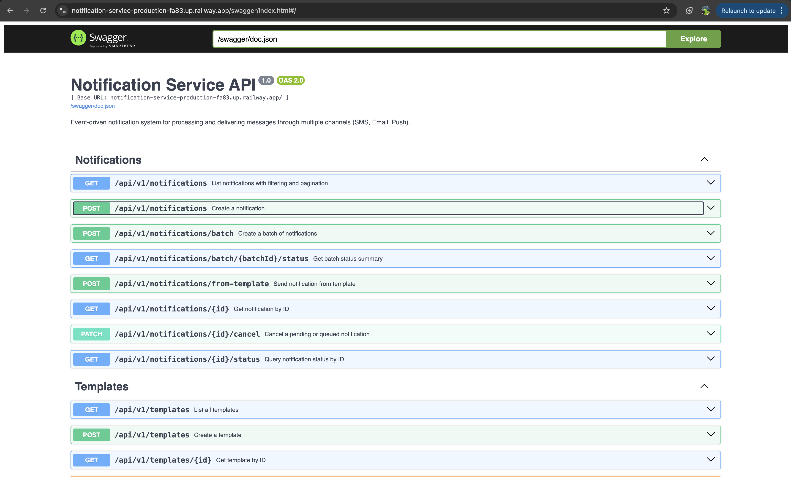
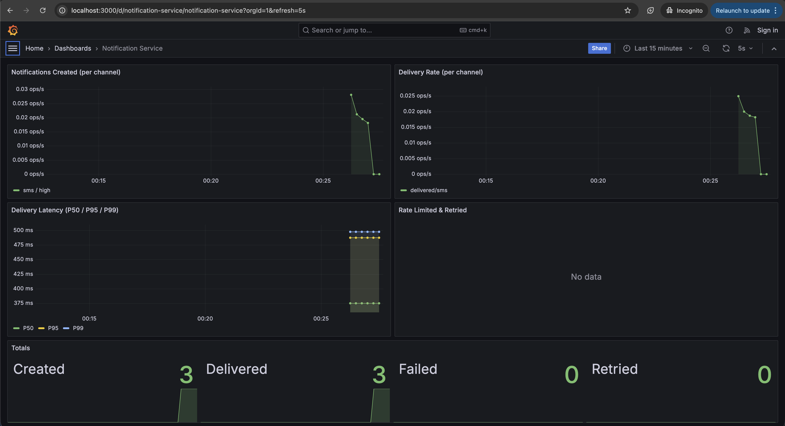
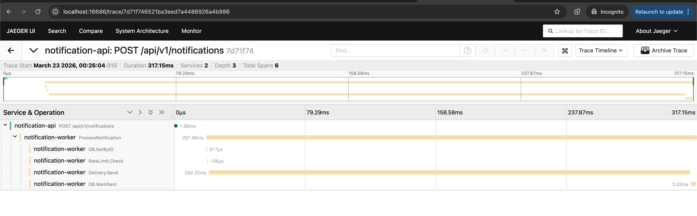
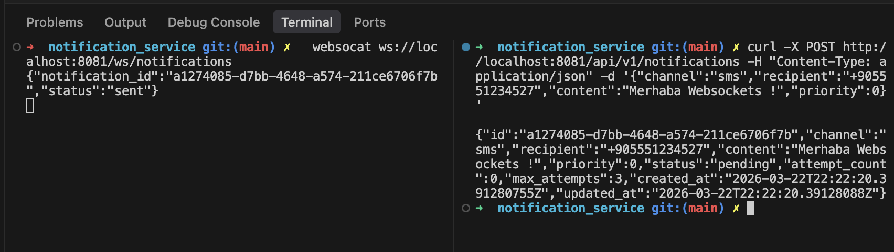

# Notification Service

[](https://github.com/beyzacanbay/notification-service/actions/workflows/ci.yml)
[](https://codecov.io/gh/beyzacanbay/notification-service)
[](https://go.dev)
[](https://gofiber.io)
[](https://www.postgresql.org)
[](https://redis.io)
[](https://docs.docker.com/compose/)
[](https://notification-service-production-fa83.up.railway.app/swagger/)
[](LICENSE)

Event-driven notification system that processes and delivers messages through multiple channels (SMS, Email, Push) with reliable delivery, retry logic, and real-time status tracking.

## 🚀 Live Demo

> **The system is deployed and running right now.** API, Worker, PostgreSQL, and Redis are all live on Railway. You can hit the endpoints below — notifications will be created, queued, processed by the worker, and delivered to webhook.site in real-time.

**Base URL:** `https://notification-service-production-fa83.up.railway.app`

**1. Try the API** — send a notification and watch it get delivered:

```bash
curl -sS -X POST "https://notification-service-production-fa83.up.railway.app/api/v1/notifications" \
  -H "Content-Type: application/json" \
  -d '{
    "channel": "push",
    "recipient": "example-device-token",
    "content": "Hello from the notification service demo"
  }'
```

**2. See it arrive** at [webhook.site](https://webhook.site/#!/view/f0eac640-19c0-49f6-a32d-be5f8bcffb1e) — the worker’s HTTP POST shows up within seconds.

**3. Browse the API docs** — full Swagger UI is live at [`/swagger`](https://notification-service-production-fa83.up.railway.app/swagger/)



## Quick Start - Local

```bash
docker compose up --build
```

This starts: API (`:8081`), Worker, PostgreSQL, Redis, Jaeger (`:16686`), and runs migrations automatically.

## Architecture

```
                    ┌─────────────┐
                    │   Client    │
                    └──────┬──────┘
                           │
                    ┌──────▼──────┐
                    │   Fiber API │
                    │  (cmd/api)  │
                    └──┬───┬───┬──┘
                       │   │   │
              ┌────────┘   │   └────────┐
              ▼            ▼            ▼
         ┌────────┐  ┌─────────┐  ┌─────────┐
         │Postgres│  │  Redis  │  │ Jaeger  │
         │  (DB)  │  │ (Queue) │  │(Tracing)│
         └────────┘  └────┬────┘  └─────────┘
                          │
                    ┌─────▼──────┐
                    │   Worker   │
                    │(cmd/worker)│
                    └─────┬──────┘
                          │
                    ┌─────▼──────┐
                    │  Webhook   │
                    │ (Provider) │
                    └────────────┘
```

**API** receives notification requests, validates them, persists to PostgreSQL, and enqueues to Redis sorted sets. **Worker** consumes from priority queues, applies rate limiting, delivers via channel-specific providers (webhook), and handles retries with exponential backoff + jitter.

Both processes are independently deployable and horizontally scalable.

## API Endpoints

### Notifications

| Method | Path | Description |
|--------|------|-------------|
| `POST` | `/api/v1/notifications` | Create notification |
| `POST` | `/api/v1/notifications/batch` | Batch create (up to 1000) |
| `POST` | `/api/v1/notifications/from-template` | Send from template |
| `GET` | `/api/v1/notifications` | List with filtering & pagination |
| `GET` | `/api/v1/notifications/:id` | Get by ID |
| `GET` | `/api/v1/notifications/:id/status` | Query status |
| `GET` | `/api/v1/notifications/batch/:batchId/status` | Batch status summary |
| `PATCH` | `/api/v1/notifications/:id/cancel` | Cancel pending notification |

### Templates

| Method | Path | Description |
|--------|------|-------------|
| `POST` | `/api/v1/templates` | Create template |
| `GET` | `/api/v1/templates` | List templates |
| `GET` | `/api/v1/templates/:id` | Get by ID |
| `PUT` | `/api/v1/templates/:id` | Update |
| `DELETE` | `/api/v1/templates/:id` | Delete |

### Observability

| Method | Path | Description |
|--------|------|-------------|
| `GET` | `/health` | Liveness check |
| `GET` | `/ready` | Readiness check (pings DB & Redis) |
| `GET` | `/metrics` | Prometheus metrics (HTTP + business) |
| `GET` | `/swagger/` | Swagger UI |
| `WS` | `/ws/notifications` | Real-time status updates via WebSocket |

## API Examples

**Create notification:**
```bash
curl -X POST http://localhost:8081/api/v1/notifications \
  -H "Content-Type: application/json" \
  -d '{
    "channel": "sms",
    "recipient": "+905551234567",
    "content": "Your verification code is 1234",
    "priority": 0
  }'
```

**Scheduled notification:**
```bash
curl -X POST http://localhost:8081/api/v1/notifications \
  -H "Content-Type: application/json" \
  -d '{
    "channel": "email",
    "recipient": "user@example.com",
    "content": "Your weekly report is ready",
    "scheduled_at": "2026-03-23T10:00:00Z"
  }'
```

**Batch create:**
```bash
curl -X POST http://localhost:8081/api/v1/notifications/batch \
  -H "Content-Type: application/json" \
  -d '{
    "notifications": [
      {"channel": "sms", "recipient": "+905551234567", "content": "Hello 1"},
      {"channel": "email", "recipient": "user@example.com", "content": "Hello 2"},
      {"channel": "push", "recipient": "device-token-abc", "content": "Hello 3", "priority": 0}
    ]
  }'
```

**Send from template:**
```bash
# Create template
curl -X POST http://localhost:8081/api/v1/templates \
  -H "Content-Type: application/json" \
  -d '{
    "name": "welcome_sms",
    "channel": "sms",
    "content_template": "Welcome {{.Name}}! Your code: {{.Code}}"
  }'

# Send using template
curl -X POST http://localhost:8081/api/v1/notifications/from-template \
  -H "Content-Type: application/json" \
  -d '{
    "template_id": "<template-uuid>",
    "recipient": "+905551234567",
    "params": {"Name": "Beyza", "Code": "5678"}
  }'
```

**Idempotency (explicit key):**
```bash
curl -X POST http://localhost:8081/api/v1/notifications \
  -H "Content-Type: application/json" \
  -H "Idempotency-Key: unique-request-123" \
  -d '{"channel": "sms", "recipient": "+905551234567", "content": "Hello"}'
```

**WebSocket status updates:**
```bash
websocat ws://localhost:8081/ws/notifications
# Receives: {"notification_id":"abc-123","status":"sent"}
```

## Design Decisions

### Processing Engine

- **Priority Queues**: 9 Redis sorted sets (`queue:{high|normal|low}:{sms|email|push}`). Score = Unix millisecond timestamp, enabling both FIFO ordering and scheduled delivery.
- **Weighted Fair Queuing**: Per 10 dequeue cycles: 6 high, 3 normal, 1 low. Prevents starvation of lower priorities while maintaining high-priority throughput.
- **Rate Limiting**: Redis sliding window, 100 messages/second/channel. Exceeded requests are requeued with short delay, not dropped.
- **Concurrency**: Configurable worker goroutines (`WORKER_CONCURRENCY`), each independently consuming from queues.

### Delivery & Retry

- **Channel-specific providers**: SMS, Email, Push — each with its own provider struct. All currently hitting webhook.site, but designed for easy swap to real providers (Twilio, SendGrid, Firebase).
- **Exponential backoff with jitter**: `delay = baseDelay * 2^attempt + random(0, baseDelay)`. Prevents thundering herd on retries.
- **Error classification**: `RetryableError` (5xx, timeout, 429) → retry with backoff. `PermanentError` (4xx) → fail immediately, send to DLQ.
- **Dead Letter Queue**: Redis hash. Failed notifications after max retries (default 3) are preserved for inspection.
- **Circuit Breaker**: Currently not implemented a CB but it would be very helpful to protect unresponsive provider. 

### Idempotency

Dual-layer deduplication:
1. **Explicit**: `Idempotency-Key` header for client retry safety
2. **Auto-hash**: `sha256(channel:recipient:content)` as fallback — prevents duplicate content within 24h

Both stored in Redis with 24h TTL. No database pollution.

### Observability

- **Structured logging**: JSON format, every log includes correlation ID
- **Correlation IDs**: Auto-generated per request, propagated through context, included in response headers
- **Distributed tracing**: OpenTelemetry → Jaeger. API and Worker spans linked via Redis trace context propagation — single trace shows full notification lifecycle
- **Prometheus metrics**: `/metrics` endpoint exposes business metrics (notifications created/delivered/failed/retried per channel, delivery duration histogram, rate limit hits)
- **Grafana dashboard**: Pre-configured dashboard with delivery rates, latency percentiles, retry/rate-limit counters, and totals
- **Health checks**: `/health` (liveness), `/ready` (dependency health — pings PostgreSQL and Redis)
- **WebSocket**: Real-time push updates when notification status changes (sent/failed)

#### Grafana Dashboard


#### Jaeger Distributed Tracing


#### WebSocket Real-time Updates


### Content Validation

Channel-specific rules:
| Channel | Recipient Format | Content Limit |
|---------|-----------------|---------------|
| SMS | E.164 phone number | 1600 chars |
| Email | Valid email address | 100 KB |
| Push | Device token (min 10 chars) | 4096 chars |

### Template System

Templates are stored in PostgreSQL with Go `text/template` syntax — variables like `{{.Name}}` and `{{.Code}}` are replaced with actual values at send time via the `params` field in the request. Channel is defined on the template, ensuring SMS templates only go via SMS.

## Project Structure

```
cmd/
  api/main.go              # HTTP API entrypoint
  worker/main.go           # Queue worker entrypoint
internal/
  bootstrap/               # Shared initialization (DB, Redis, tracing)
  config/                  # Environment-based configuration
  handler/                 # HTTP handlers (thin — parse, validate, respond)
  service/                 # Business logic (idempotency, batch, cancel)
  repository/              # PostgreSQL data access (interface + implementation)
  queue/                   # Redis sorted set producer/consumer, DLQ
  delivery/                # Channel providers, retry logic, error types
  ratelimiter/             # Redis sliding window rate limiter
  worker/                  # Dispatcher + processor
  middleware/              # Correlation ID, logging, recovery, tracing
  websocket/               # Real-time status updates via Redis Pub/Sub
  tracing/                 # OpenTelemetry setup + cross-process propagation
  validator/               # Channel-specific input validation
  model/                   # Domain models
  dto/                     # Request/response types
migrations/                # Versioned PostgreSQL schema changes
docs/swagger/              # Auto-generated OpenAPI spec
```

## Makefile

```bash
make run-api          # Run API locally
make run-worker       # Run worker locally
make build            # Build both binaries
make test             # Run all tests
make test-e2e         # Run E2E tests only
make test-unit        # Run unit tests only
make lint             # golangci-lint
make swagger          # Regenerate Swagger docs
make docker-up        # docker compose up --build -d
make docker-down      # docker compose down -v
make scale-workers N=3  # Scale worker instances
```

## Environment Variables

| Variable | Default | Description |
|----------|---------|-------------|
| `SERVER_PORT` | `8081` | API server port |
| `DB_HOST` | `localhost` | PostgreSQL host |
| `DB_PORT` | `5432` | PostgreSQL port |
| `DB_USER` | `postgres` | PostgreSQL user |
| `DB_PASSWORD` | `postgres` | PostgreSQL password |
| `DB_NAME` | `notifications` | PostgreSQL database |
| `DB_SSL_MODE` | `disable` | PostgreSQL SSL mode |
| `REDIS_HOST` | `localhost` | Redis host |
| `REDIS_PORT` | `6379` | Redis port |
| `REDIS_PASSWORD` | ` ` | Redis password |
| `REDIS_DB` | `0` | Redis database |
| `WORKER_CONCURRENCY` | `5` | Worker goroutines |
| `WORKER_RATE_LIMIT` | `100` | Max messages/sec/channel |
| `WORKER_MAX_RETRIES` | `3` | Max delivery attempts |
| `WORKER_RETRY_BASE_DELAY` | `1s` | Retry base delay |
| `WORKER_RETRY_MAX_DELAY` | `5m` | Retry max delay |
| `WEBHOOK_URL` | `https://webhook.site/test` | Delivery endpoint |
| `WEBHOOK_TIMEOUT` | `10s` | HTTP timeout |
| `OTEL_EXPORTER_ENDPOINT` | `localhost:4318` | Jaeger OTLP endpoint |
| `OTEL_ENABLED` | `true` | Enable distributed tracing |

## Testing

```bash
# All tests
make test

# Output
ok  internal/handler   — 20 tests (unit + E2E)
ok  internal/validator  — 6 tests (channel validation)
```

Tests use mock repositories and producers — no external dependencies. E2E tests cover full request lifecycle: create → query → cancel, batch with partial failure, scheduled notifications, idempotency, pagination.

## CI/CD

GitHub Actions pipeline (`.github/workflows/ci.yml`):
1. **Lint** — golangci-lint
2. **Test** — `go test -race`
3. **Build & Push** — Docker image to `ghcr.io` (on main branch only)

## Notification Lifecycle

```
Client Request
     │
     ▼
  Validate ──── fail ──► 400 Bad Request
     │
     ▼
  Idempotency ── duplicate ──► Return existing
     │
     ▼
  Save to DB (status: pending)
     │
     ▼
  Enqueue to Redis (score: now or scheduled_at)
     │
     ▼
  Return 202 Accepted
     │
     ▼
  Worker dequeues (weighted fair queuing)
     │
     ▼
  Rate limit check ── exceeded ──► Requeue with delay
     │
     ▼
  Status: processing
     │
     ▼
  Deliver via provider (HTTP POST to webhook)
     │
     ├── Success ──► Status: sent + WebSocket broadcast
     │
     └── Failure
          ├── Retryable (5xx/timeout) ──► Increment attempt + backoff + requeue
          ├── Permanent (4xx) ──► Status: failed + DLQ
          └── Max retries exceeded ──► Status: failed + DLQ
```
